# netty-transport-nethernet

## Downloads

### Releases 

The library is published to Maven Central. See the [latest release](https://github.com/Kas-tle/NetworkCompatible/releases/latest) for the latest version.

### Snapshots 

Snapshots are available from [jitpack](https://jitpack.io/#dev.kastle/NetworkCompatible). Note the package group for jitpack is `dev.kastle.NetworkCompatible` witht the name `netty-transport-nethernet`.

## Usage

> [!IMPORTANT]
> This library requires the platform-specific WebRTC native libraries at runtime. See [Kas-tle/webrtc-java](https://github.com/Kas-tle/webrtc-java?tab=readme-ov-file#usage) for instructions on how to include the native libraries in your project.

### Examples

These projects use this library to provide Nethernet support. You can see their source code for examples of how to use this library:

- [Kas-tle/ProxyPass](https://github.com/Kas-tle/ProxyPass): Uses server and client to debug game packets over various connection types.
- [MCXboxBroadcast/Broadcaster](https://github.com/MCXboxBroadcast/Broadcaster): Uses server to allow Bedrock clients to transfer to other Bedrock servers via Xbox Live.
- [ViaVersion/ViaFabricPlus](https://github.com/ViaVersion/ViaFabricPlus): Uses client to connect to LAN games and Realms.
- [ViaVersion/ViaProxy](https://github.com/ViaVersion/ViaProxy): Uses client to connect to LAN games and Realms.

## Packet Flow

### Client

---

<picture>
  <source media="(prefers-color-scheme: dark)" srcset="../.github/readme/nethernet_client_dark.svg">
  
</picture>

### Server

---

<picture>
  <source media="(prefers-color-scheme: dark)" srcset="../.github/readme/nethernet_server_dark.svg">
  
</picture>