# netty-transport-raknet

## Changes from Original Library

- New incoming connection batches additional packets to more closely imitate the vanilla client (from [@RaphiMC](https://github.com/RaphiMC)):
  - A `Connected Ping`
  - The first game packet, `Request Network Settings Packet`
- Allows for resetting security state if `Open Connection Reply 1` is resent by the server
- Only do retries with `Open Connection Request 1`, and reserve `Open Connection Request 2` only as a direct response to `Open Connection Reply 1`
- Allows using datagram channel factories for raknet (from [@AlexProgrammerDE](https://github.com/AlexProgrammerDE))
- Skips over improperly typed client address fields
- Does not set RakNet flag `NEEDS_B_AND_AS` on client messages

## Downloads

### Releases 

The library is published to Maven Central. See the [latest release](https://github.com/Kas-tle/NetworkCompatible/releases/latest) for the latest version.

### Snapshots 

Snapshots are available from [jitpack](https://jitpack.io/#dev.kastle/NetworkCompatible). Note the package group for jitpack is `dev.kastle.NetworkCompatible` witht the name `netty-transport-raknet`.

## Usage

### Examples

These projects use this library to provide Raknet support. You can see their source code for examples of how to use this library:

- [Kas-tle/ProxyPass](https://github.com/Kas-tle/ProxyPass): Uses server and client to debug game packets over various connection types.
- [ViaVersion/ViaFabricPlus](https://github.com/ViaVersion/ViaFabricPlus): Uses client to connect to Bedrock servers.
- [ViaVersion/ViaProxy](https://github.com/ViaVersion/ViaProxy): Uses client to connect to Bedrock servers.

## Packet Flow

### Client

---

<picture>
  <source media="(prefers-color-scheme: dark)" srcset="../.github/readme/raknet_client_dark.svg">
  
</picture>

### Server

---

<picture>
  <source media="(prefers-color-scheme: dark)" srcset="../.github/readme/raknet_server_dark.svg">
  
</picture>